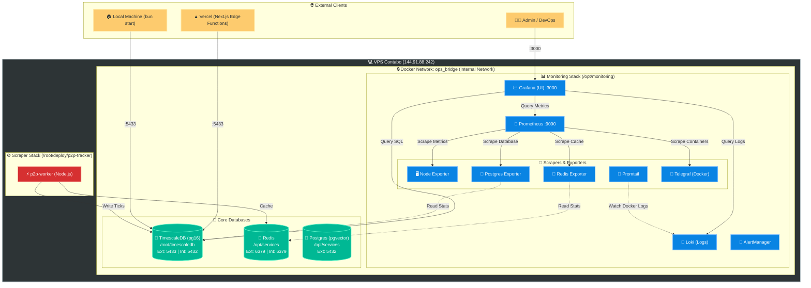

# P2P Tracker Infrastructure Architecture

Tài liệu này mô tả toàn cảnh kiến trúc Monitoring (Giám sát) và Database (Cơ sở dữ liệu) của hệ thống **P2P Tracker** trên VPS Contabo.

Hệ thống được thiết kế theo chuẩn **Micro-segmentation (Zero-Trust)** giữa các cụm Docker Compose, đảm bảo các dịch vụ giám sát nội bộ không cần mở IP Public mà vẫn tương tác mượt mà với các Database cốt lõi.

---

## 🗺 Sơ đồ Kiến trúc Tổng quan (Mermaid)

---

## 🧩 Giải phẫu các thành phần cốt lõi

### 1. Mạng ảo `ops_bridge` (Zero-Trust)

Thay vì để các cụm Docker Compose nằm riêng rẽ khép kín, hệ thống sử dụng một mạng nội bộ chung có tên là `ops_bridge`.

- **Bảo mật**: Các công cụ như Grafana, Postgres-exporter có thể "nhìn thấy" và truy vấn thẳng vào TimescaleDB qua hostname nội bộ (ví dụ: `timescaledb:5432` hoặc `redis:6379`) hoàn toàn ẩn danh, không cần đi vòng ra IP Public.
- **Tối ưu Network**: Giảm tải cho tường lửa (iptables) và băng thông public.

### 2. Cụm Giám sát (`/opt/monitoring`)

- **Grafana**: Dashboard trung tâm, hiển thị Metric, Log và Tracing SQL.
- **Prometheus**: Não bộ lưu trữ Metric (Time-series), 15 giây lấy dữ liệu từ các Exporter 1 lần.
- **Loki & Promtail**: Promtail giám sát thư mục `/var/lib/docker/containers` để hốt toàn bộ log của tất cả các container trên VPS và đẩy về Loki. Grafana sẽ dùng Loki để query log.
- **Telegraf**: Chuyên gia soi RAM và CPU thời gian thực cho từng container (bằng cách móc vào `docker.sock` và `/host/proc`).
- **AlertManager**: Đẩy cảnh báo về Telegram/Slack khi CPU quá tải (có rule Z-Score quét Anomaly).

### 3. Cụm Databases

Được tách riêng rẽ để đảm bảo độc lập dữ liệu:

- **TimescaleDB (`/root/timescaledb`)**: Lưu trữ giá xăng, giá vàng, ngoại tệ dạng chuỗi thời gian (Time-series). Mở port `5433` ra ngoài cho Next.js/Vercel.
- **Redis (`/opt/services`)**: Môi trường cache siêu tốc.
- **PGVector (`/opt/services`)**: Database chuyên dùng để lưu trữ Vector Embeddings cho AI News, RAG.
