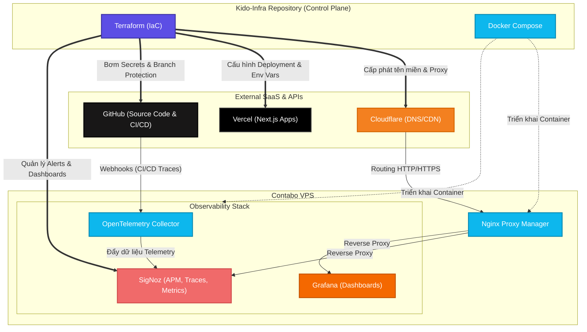

# Kido-Infra Architecture

Sơ đồ dưới đây mô tả kiến trúc tổng thể của `kido-infra`, đóng vai trò là "Control Plane" (Trung tâm điều khiển) cho toàn bộ hệ sinh thái của bạn, kết hợp giữa **Infrastructure as Code (Terraform)** và **Containerized Services (Docker Compose)**.

## Diễn giải kiến trúc:

1. **Control Plane (`kido-infra`)**:
   - Chứa code Terraform để tự động hóa toàn bộ hạ tầng (DNS, GitHub, Vercel, SigNoz).
   - Chứa các file `docker-compose.yml` để dựng các dịch vụ core trên máy chủ.
   
2. **Infrastructure as Code (Terraform)**:
   - Thay vì setup bằng tay, Terraform giao tiếp với API của các bên thứ ba (Cloudflare, Vercel, GitHub, SigNoz) để đồng bộ hóa trạng thái mong muốn từ code thành thực tế.

3. **Contabo VPS**:
   - Dùng **Nginx Proxy Manager** làm Gateway để nhận request từ Cloudflare và điều phối vào trong.
   - Chạy cụm **Observability Stack** (SigNoz, Grafana, OpenTelemetry) để giám sát hiệu năng hệ thống.

4. **Data Flow**:
   - GitHub bắn webhook mỗi khi có Action chạy về OpenTelemetry Collector. Collector xử lý rồi ném cho SigNoz vẽ ra các biểu đồ CI/CD.
