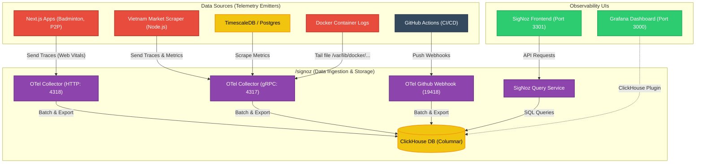

# Observability Stack Architecture (SigNoz & Grafana)

Tài liệu này đi sâu vào kiến trúc chi tiết của cụm **Observability** nằm trong hai thư mục `signoz` và `grafana` trên VPS Contabo của bạn. Đây là trái tim của hệ thống giám sát, thu thập mọi log, metric và trace từ các dịch vụ khác.

## 1. Kiến trúc luồng dữ liệu (Data Flow) chi tiết

Sơ đồ dưới đây mô tả cách dữ liệu (Traces, Metrics, Logs) chảy từ các App của bạn vào OTel Collector, được lưu trữ tại ClickHouse và hiển thị lên UI của SigNoz / Grafana.

---

## 2. Chi tiết thư mục `/signoz`

Thư mục này chứa core engine của hệ thống giám sát. Thay vì xài Datadog tốn phí, bạn đang host một hệ thống mạnh tương đương.

- **`docker-compose.yaml`**: Chứa toàn bộ các service của SigNoz (Zookeeper, Clickhouse, Query Service, Frontend, OTel Collector).
- **`otel-collector-config.yaml`**: Đây là **bộ não** định tuyến dữ liệu. Nó định nghĩa:
  - `receivers`: Các cổng mở ra để đón dữ liệu (ví dụ: gRPC `4317` cho backend, HTTP `4318` cho Next.js, Webhook `19418` cho GitHub). Nó cũng chủ động đọc file log của Docker (`filelog/containers`).
  - `processors`: Xử lý, nhào nặn dữ liệu (ví dụ: gán thêm thẻ `service.name: github-actions` cho data từ GitHub, lọc các log rác).
  - `exporters`: Đẩy toàn bộ dữ liệu đã xử lý vào ClickHouse để lưu trữ tối ưu.
- **ClickHouse**: Database dạng cột (Columnar Database) cực kỳ tối ưu cho việc đọc/ghi log và time-series data tốc độ cao.

## 3. Chi tiết thư mục `/grafana`

Dù SigNoz đã rất mạnh, Grafana vẫn được giữ lại để phục vụ các biểu đồ tùy biến phức tạp (Custom Dashboards) hoặc khi cần monitor các metric hạ tầng truyền thống.

- **`docker-compose.yaml`**: Dựng Grafana độc lập.
- **`provisioning/datasources/`**: Cấu hình tự động kết nối Grafana vào ClickHouse hoặc Prometheus của SigNoz. Nhờ vậy Grafana có thể lấy chung một nguồn dữ liệu với SigNoz.
- **`dashboards/`**: Thư mục chứa các file JSON (như `Web Vitals Monitoring (1).json`). Grafana sẽ tự động load các file này lên UI mà không cần bạn phải import bằng tay.

## 4. Sự tương hỗ giữa SigNoz và Grafana

- **SigNoz**: Dùng làm công cụ **Troubleshooting & APM** chính. Khi App sập hoặc API chậm, bạn vào SigNoz xem Flamegraph (Traces) để biết chính xác hàm nào trong code chạy chậm. Bạn cũng xem Log trực tiếp tại đây.
- **Grafana**: Dùng làm công cụ **Executive Dashboard**. Hiển thị các biểu đồ tổng quan về Business (số lượng user, tài nguyên VPS tổng thể) lên màn hình lớn hoặc chia sẻ cho team không chuyên về kỹ thuật xem.
