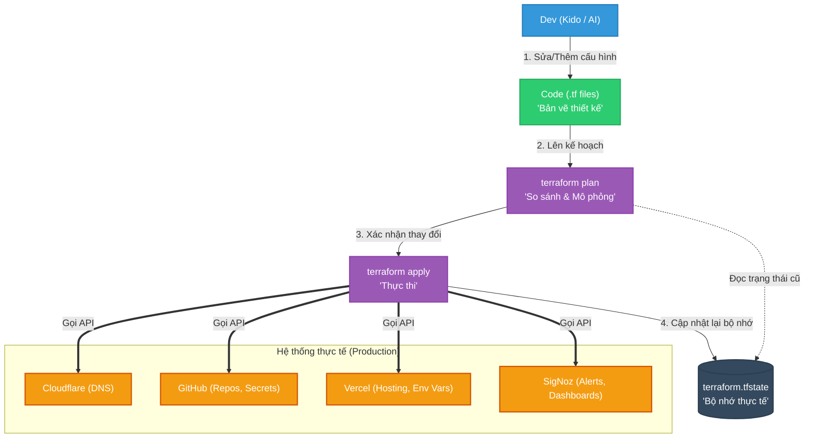

# Kiến trúc & Luồng hoạt động của Terraform (Infrastructure as Code)

Tài liệu này sẽ giúp bạn hình dung rõ ràng "cái thứ tên là Terraform này rút cuộc giúp ích được gì cho mình?". Nói một cách đơn giản, Terraform biến bạn từ một người **thợ xây** (phải tự tay làm từng việc) thành một **kiến trúc sư** (chỉ cần vẽ bản vẽ, máy móc sẽ tự xây).

---

## 1. Luồng hoạt động (The Terraform Flow)

Thay vì bạn phải đăng nhập vào 4 trang web khác nhau (Cloudflare, GitHub, Vercel, SigNoz) để bấm các nút cấu hình, mọi thứ giờ đây tập trung tại một luồng duy nhất.

### Giải thích 4 bước thần thánh:
1. **Code (`.tf`)**: Bạn khai báo *kết quả cuối cùng* bạn muốn (Ví dụ: "Tôi muốn có 1 domain tên là `api.khanhdp.com`").
2. **Plan**: Terraform sẽ kiểm tra hệ thống thực tế xem domain đó có chưa. Nếu chưa có, nó sẽ in ra màn hình: *"Domain này chưa có, tôi chuẩn bị TẠO MỚI nhé?"*. Nếu có rồi mà bị sai IP, nó báo: *"IP bị sai, tôi chuẩn bị SỬA LẠI nhé?"*.
3. **Apply**: Nếu bạn gõ `yes`, Terraform sẽ tự động gọi API của Cloudflare để làm đúng những gì nó vừa hứa.
4. **State (`.tfstate`)**: Làm xong, nó ghi nhớ kết quả vào file State để lần sau không bị nhầm lẫn.

---

## 2. Rút cuộc Terraform làm được gì cho hệ thống của tôi?

Dưới đây là các "Siêu năng lực" cụ thể mà Terraform mang lại cho hạ tầng `kido-infra`:

### 🎯 Khắc phục thảm họa (Disaster Recovery) siêu tốc
- **Vấn đề**: Giả sử VPS của bạn bị cháy ổ cứng, hoặc lỡ tay xóa nhầm toàn bộ Dashboard siêu đẹp trên Grafana/SigNoz. Nếu setup bằng tay, bạn sẽ phải tốn hàng tuần để nhớ lại và cấu hình lại từ đầu.
- **Terraform làm gì**: Bấm 1 nút `terraform apply`. Chờ 1 phút. Toàn bộ DNS, Github Secrets, Vercel Env Vars, và Dashboards được tạo lại y chang như lúc đầu.

### 🎯 Cập nhật hàng loạt (Mass Update) thay vì làm "Cửu vạn"
- **Vấn đề**: Bạn đổi IP của VPS. Bạn có 10 subdomains (api, grafana, signoz, otel...). Bạn phải vào Cloudflare click chuột sửa tay 10 lần. Sau đó bạn phải vào 5 repo GitHub để sửa secret `VPS_HOST`. Sau đó vào Vercel sửa biến môi trường. Rất mệt và dễ sai sót.
- **Terraform làm gì**: Bạn chỉ cần sửa 1 biến duy nhất `shared_vps_host = "IP_MOI"` trong file `variables.tf`. Chạy lệnh. Terraform tự động vác cái IP mới đó đem đi cập nhật cho Cloudflare, chèn vào 5 repo GitHub, chèn vào Vercel. Không trật 1 li.

### 🎯 Giao tiếp cực hiệu quả với AI (Open Claw / Cursor)
- **Vấn đề**: AI rất giỏi code, nhưng nó không có mắt để nhìn giao diện UI của Vercel hay Cloudflare. Nếu bạn cấu hình bằng tay trên Web, AI sẽ mù tịt không biết hạ tầng đang kết nối với nhau thế nào (VD: App NextJS đang chọc vào database nào?).
- **Terraform làm gì**: Code Terraform chính là "Ngôn ngữ giao tiếp chung". AI đọc thư mục `terraform/` là hiểu toàn bộ hạ tầng: *"À, repo badminton đang được host ở Vercel, xài biến môi trường NEXT_PUBLIC_API_URL trỏ về server api.khanhdp.com, và domain này được proxy qua Cloudflare"*. Nó hiểu 100% ngữ cảnh mà không cần bạn phải giải thích.

### 🎯 Quản lý bảo mật (Ai làm gì, khi nào?)
- **Vấn đề**: Bạn cấp tài khoản GitHub/Cloudflare cho người khác (hoặc AI), họ vào UI bấm xóa nhầm repo hoặc phá cấu hình, bạn không thể tìm ra ai làm.
- **Terraform làm gì**: Mọi thay đổi đều là Code. Khi muốn thêm/sửa hạ tầng, người đó (hoặc AI) phải sửa code `.tf` và tạo Pull Request (PR). Bạn là người review code, nếu OK mới duyệt. Lịch sử Git lưu lại vĩnh viễn ai đã sửa hạ tầng, vào ngày nào, và vì lý do gì.

## Tóm lại
`kido-infra/terraform` chính là **Bản kiểm soát quyền lực tuyệt đối** của bạn đối với toàn bộ hệ thống phân tán bên ngoài VPS!
